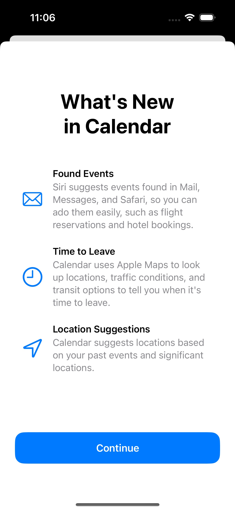

# Onboarding

A modular package recreating the onboarding experience in Apple's native app.
Written only using SwiftUI.



Recreated Apple Calendar onboarding experience. Copyright (c) content:
Apple, Inc.

## Syntax

```swift
import Onboarding

struct ContentView: View {
    @State var showOnboarding = UserDefaults.standard.bool(forKey: "onboarding") {
        didSet {
            UserDefaults.standard.setValue(!showOnboarding, forKey: "onboarding")
        }
    }
        
    let onboardingElements = [
        OnboardingElement(
            image: Image(systemName: "envelope"),
            header: "Found Events",
            description: "Siri suggests events found in Mail, Messages, and Safari, so you can ado them easily, such as flight reservations and hotel bookings."
        ),
        OnboardingElement(
            image: Image(systemName: "clock"),
            header: "Time to Leave",
            description: "Calendar uses Apple Maps to look up locations, traffic conditions, and transit options to tell you when it's time to leave."
        ),
        OnboardingElement(
            image: Image(systemName: "location"),
            header: "Location Suggestions",
            description: "Calendar suggests locations based on your past events and significant locations."
        )

    ]
    
    var body: some View {
        GeometryReader { geometry in
            Color.clear
                .sheet(isPresented: $showOnboarding) {
                    OnboardingView(
                        showOnboarding: $showOnboarding,
                        title: "What's New in Calendar",
                        elements: onboardingElements
                    )
                    .interactiveDismissDisabled()
                }
        }
    }
}
```

